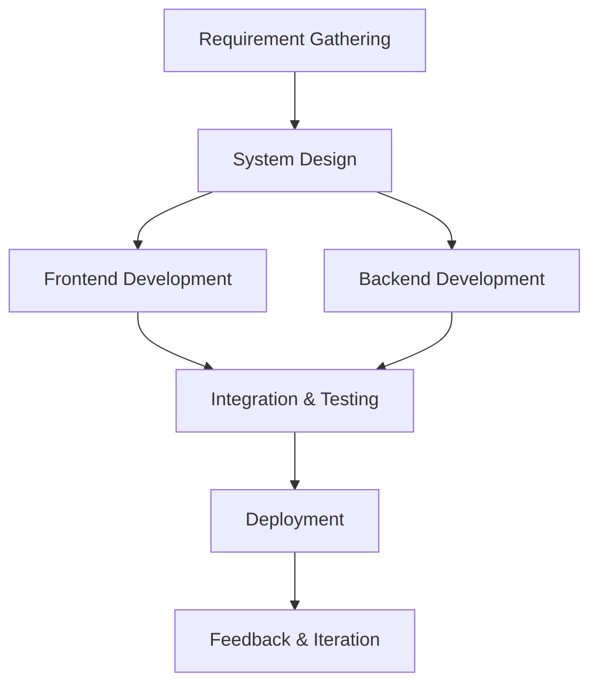

# 🚀 MERN Stack Billing System  
*Seamlessly transform your billing processes with modern tech solutions.*  
# 📸 Image Gallery  
Explore the UI of the **MERN Stack Billing System** through these images:  

<div align="center">
  <table>
    <tr>
      <td><p>Home Ui -1</p>
         </td>
      <td><p>Home Ui -2</p>
         </td>
    </tr>
    <tr>
      <td><p>Customer Page</p>
         </td>
      <td><p>Order Page</p>
         </td>
    </tr>
    <tr>
      <td><p>Invoices Page</p> 
         </td>
      <td><p>Payment Page</p>
         </td>
    </tr>
  </table>
</div>

---

## ✨ Project Functionalities  

The **MERN Stack Billing System** offers a suite of features to simplify billing management for businesses:  

- **Customer Section**: Add, update, delete, and manage customer profiles with ease.  
- **Product Section**: Manage product inventory, retrieve product data using barcode scanning (powered by Quagga.js), and track stock levels.  
- **Order Processing**: Record orders, calculate totals, and adjust inventory in real-time.  
- **Payment Section**: Monitor customer payments and automatically update their balances.  
- **Walk-In Orders**: Manage transactions for one-time customers without adding them to the database.  
- **PDF Invoice Generation**: Generate professional-grade invoices instantly using PDFKit.  
- **Company Information Section**: Personalize your invoices with logo uploads via Cloudinary.  

This system combines **modern web technologies** to deliver an intuitive, scalable, and efficient solution for small and medium-sized enterprises.  

---

## 🎥 Demo  
**🎯 Experience the system in action!**  
👉 [Live Demo](#)
👉 [Walkthrough Video](#) 

---

## 🛠️ Tech Stack  

| **Category**       | **Technology**                                    |  
|---------------------|--------------------------------------------------|  
| **Frontend**        | React.js, React Toast, Sweet Alerts|  
| **Backend**         | Node.js, Express.js                              |  
| **Database**        | MongoDB                                          |  
| **PDF Handling**    | PDFKit                                           |  
| **Barcode Scanning**| Quagga.js                                        |  
| **Cloud Services**  | Cloudinary                                       |  

---

## 📦 Features  

| **Module**              | **Key Functionalities**                                     |  
|-------------------------|-----------------------------------------------------------|  
| **Customer Management** | Add, edit, delete customer records                         |  
| **Product Inventory**   | Barcode-enabled inventory updates                         |  
| **Order Processing**    | Manage, calculate, and track orders efficiently           |  
| **Payment Tracking**    | Real-time balance updates for customers                   |  
| **PDF Invoice Generation**| Generate and download detailed invoices                 |  
| **Temporary Orders**    | Handle walk-in transactions without permanent records     |  

---

## 🚀 Quick Start  

### 🖥️ Prerequisites  

- **Node.js** (>= v18.0)  
- **MongoDB** (Ensure local or cloud-based database is accessible)  
- **Cloudinary Account** (For media management)  

---

### 🔧 Installation  

1. **Clone the repository**  
   ```bash
   git clone https://github.com/Khan1git/BillingSystem-MernStack
   cd BillingSystem-MernStack
   ```  

2. **Backend setup**  
   ```bash
   cd backend
   npm install
   ```  

3. **Frontend setup**  
   ```bash
   cd ../frontend
   npm install
   ```  

4. **Environment variables**  
   Create a `.env` file at the root:  
   ```env
   MONGO_URI=<Your MongoDB URI>
   CLOUDINARY_NAME=<Cloudinary Cloud Name>
   CLOUDINARY_API_KEY=<API Key>
   CLOUDINARY_SECRET=<API Secret>
   ```  

5. **Run the app**  
   ```bash
   npm run dev
   ```  

---

## 📸 Screenshots  

### Dashboard  
  

### Customer Management  
  

### PDF Invoice Generation  
  

---

## 🔄 Workflow  



---

## 🏗️ Future Enhancements  

🔹 **AI-Powered Insights**: Analytics dashboard for sales trends and projections.  
🔹 **Mobile Support**: Fully responsive mobile-first UI.  
🔹 **Multi-Language Support**: Localization for global usage.  
🔹 **Role-Based Access**: Permissions for admins, staff, and managers.  

---

## 👥 Contributors  

| **Name**   | **Role**               |  
|------------|------------------------|  
| Arif Rahman| Developer/Designer     |  
| Arif Rahman | Lead Backend Engineer  |  

---

## 📜 License  

This project is licensed under the **MIT License**. See [LICENSE](./LICENSE) for details.  
